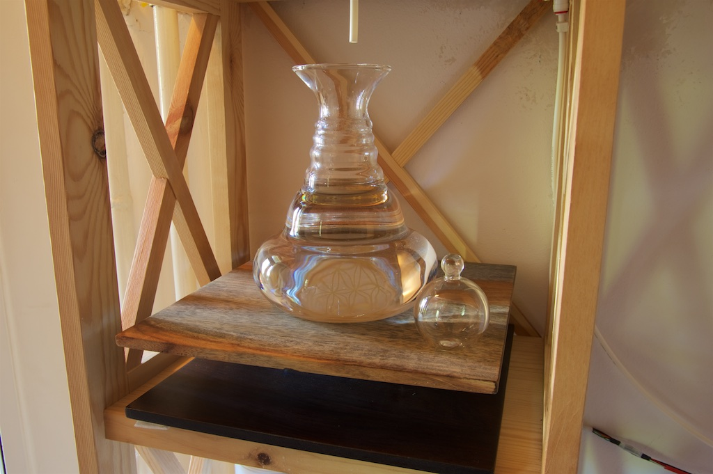
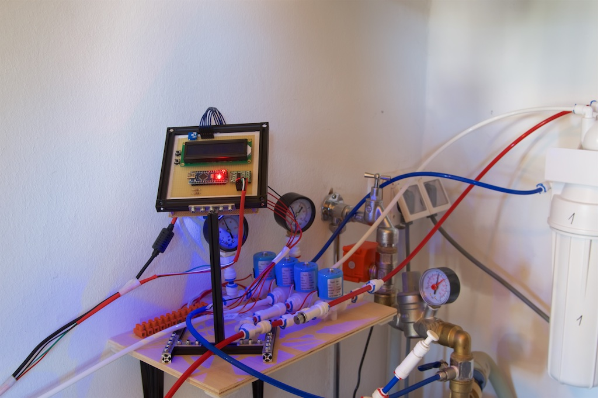
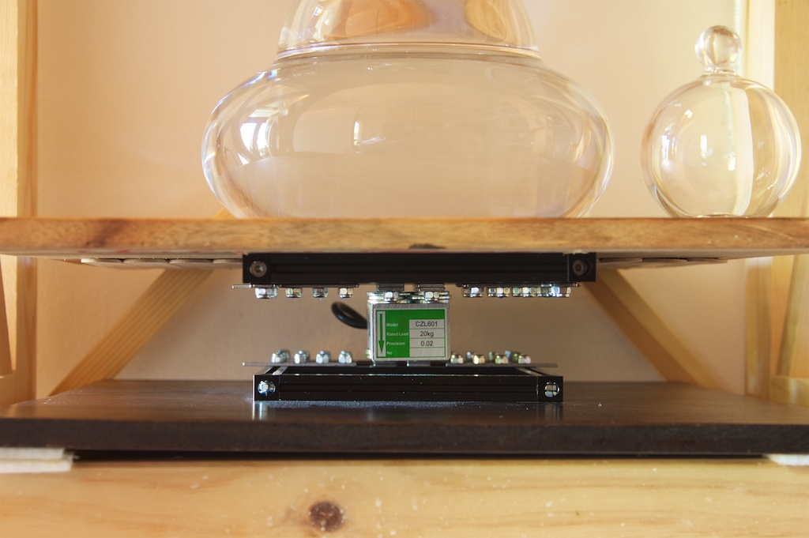
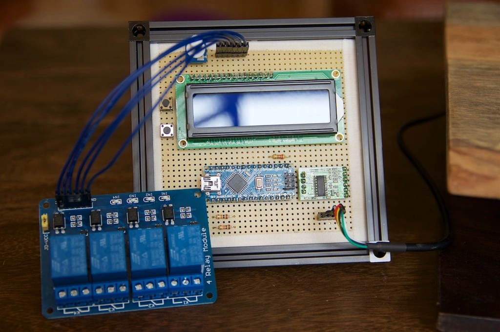
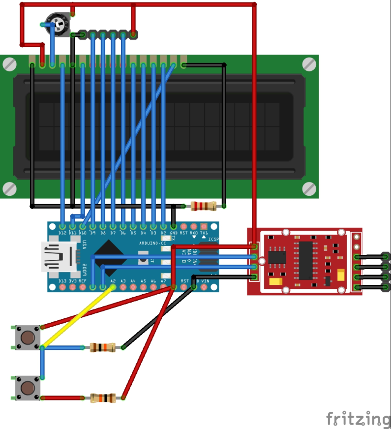
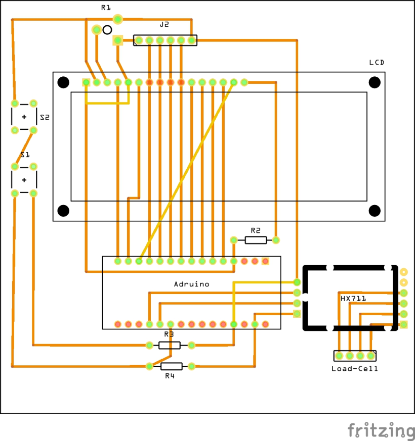

# Mein Osmose Wasserfilter

Inspiriert durch neue Ideen von Michael Scholze (<https://www.lebendiges-trinkwasser.de>), von dem ich meinen Bausatz für den Wasserfilter bezogen habe, habe ich mich im März 2016 viel mit neuen Steuerungsmöglichkeiten für meinen Wasserfilter beschäftigt. An zwei Punkte habe ich gerüttelt, um mein Lieblingswasser noch besser werden zu lassen 😉

Zum einen sollten die automatischen Spülprogramme erweitert werden um eine Nach-Spülung nach der eigentlichen Wasser-Filterung und einer Regelspülung nach 4 Stunden Filterpause. Zum zweiten waren im bisher verwendeten Wasserbehälter noch der Schwimmerschalter und der Auslaufhahn, beide aus Edelstahl, die evtl. irgendwelche Stoffe und Geschmäcker an das Wasser abgeben könnten oder als Versteck für Keime dienen.

Um die Spülprogramme zu bekommen habe ich die bisherige, einfache Relais-Steuerung durch eine Steuerung mit einem Micro-Controller (Arduino Nano) ersetzt. Dieser ist programmierbar und kann so ganz einfach Ereignis- und Zeit-gesteuert die Ventile auf und zu machen. Weiter ist er in der Lage das Wassergewicht über einen Waage-Sensor zu lesen und auf das Gewicht entsprechend zu reagieren. Den Wasserbehälter habe ich durch zwei Karaffen ersetzt, die abwechselnd eingesetzt werden.

Am Ende ist ein richtig komfortables Filtersystem herausgekommen. Wenn eine Karaffe leer ist, tausche ich diese mit der vollen Karaffe, die bereits auf der Waage steht. Sobald die leere Karaffe auf der Waage steht, schaltet der Filter ein, macht seine Vor-Spülung, füllt die Karaffe mit Wasser und beendet mit einer Nach-Spülung. Das gefilterte Wasser hat in der Karaffe keinen Kontakt mehr zu anderen Stoffen außer dem Glas der Karaffe. Und durch die zusätzlichen Spülprogramme wird das Keimrisiko reduziert und die Filterlebensdauer erhöht.

Ich bin super zufrieden mit dem Ergebnis. Und weil’s mir so gefällt, hab ich ein kleines Video von meinem Wasserfilter im Einsatz gedreht 🙂

<iframe width="560" height="315" src="https://www.youtube.com/embed/p-oMvHNbZ5M" title="YouTube video player" frameborder="0" allow="accelerometer; autoplay; clipboard-write; encrypted-media; gyroscope; picture-in-picture" allowfullscreen></iframe>

Für alle, die an den technischen Details interessiert gibt’s hier weitere Infos. Das Arduino-Programm für die Steuerung gibt’s hier und den Aufbau der Steuerung seht ihr auf diesen Bildern.

